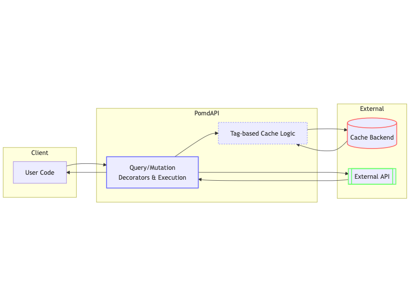

# Introduction

## PomdAPI 
**PomdAPI** is a Python library that brings a FastAPI-style developer experience to strongly-typed API clients. Inspired by FastAPI’s clarity, we needed a way to define multi-protocol API calls—HTTP, JSON-RPC, XML-RPC—without getting tangled in repetitive boilerplate.

That’s why we built PomdAPI: 

a clean, typed approach for both sync and async calls, enhanced by tag-based caching and invalidation. If you want minimal fuss, typed models, and painless caching for your APIs, we hope PomdAPI becomes your go-to choice.

## Why use PomdAPI?

 🎯 <strong class="vertical-middle"> Declarative Endpoints</strong><br>
Define your queries and mutations in a single, clear place using decorators. This means you can outline how to fetch or update data—whether it’s GitHub issues or Ethereum balances—without repeating request logic.

🚀 <strong class="vertical-middle"> Expandable Architecture</strong><br>
Enjoy out-of-the-box support for HTTP, JSON-RPC, and XML-RPC calls, with a straightforward pattern for adding any custom protocol. All protocols share the same consistent API interface, so you can reuse logic and tooling across diverse data sources.

🔒 <strong class="vertical-middle"> Type safe</strong><br>
Built with Python type hints (Generics) and Pydantic models, giving you both static time checks and runtime validation. This helps prevent bugs and ensures predictable data structures across your codebase.

⚡ <strong class="vertical-middle"> Automatic Sync/Async</strong><br>
Use the same function in synchronous or asynchronous contexts—no code duplication necessary. Whether you’re in a simple script or an async-based web framework, the library adapts seamlessly.

🔖 <strong class="vertical-middle"> Tag-Based Invalidation</strong><br>
Speed up your application by reducing unnecessary requests and handling partial data updates. Choose from in-memory, Memcached, Redis, or implement your own custom caching backend.

Whether you’re building a small prototype or a large-scale service, these features help keep your code clean, consistent, and reliable. For more hands-on guides, check out our Getting Started page or explore the Examples of how you can integrate PomdAPI into real-world projects.

To learn more about each feature, check out our [Features](features.md) page or dive straight into the [Getting Started](getting-started.md) guide.


## Example

!!! example "In Beta"
    PomdAPI is in early beta, the API might be still subject to change.


```python
from pomdapi.api.http import HttpApi, RequestDefinition
from pomdapi.cache.in_memory import InMemoryCache

# Create an API instance with in-memory caching
api = HttpApi.from_defaults(
    base_query_config=BaseQueryConfig(base_url="https://api.example.com"),
    cache=InMemoryCache()
)

# Define deserialized response type
class UserProfile(BaseModel):
    id_: str = Field(alias="id")
    name: str
    age: int

# Define a query endpoint
@api.query("getUserProfile", response_type=UserProfile)
def get_user_profile(user_id: str):
    return RequestDefinition(
        method="GET",
        url=f"/users/{user_id}"
    ), Tag("userProfile", id=user_id)


@api.mutate("updateUserProfile")
def change_user_name(user_id: str, name: str):
    return RequestDefinition(
        method="PATCH",
        url=f"/users/{user_id}",
        body={"name": name}
    ), Tag("userProfile", id=user_id) 


# Use the function in the default async context
async def main():
    profile = await get_user_profile(user_id="123") 

# or in a sync context
def main():
    profile = get_user_profile(is_async=False, user_id="123")
    # Invalidate the userProfile tag
    change_user_name(is_async=False, user_id="123", name="New Name")
    # Need to refetch the userProfile
    get_user_profile(is_async=False, user_id="123")
    print(profile)
```

## FastAPI vs. PomdAPI: An Inversion

FastAPI is a server framework that uses parameter decorators to build endpoints. For example, you write code like:

=== "FastAPI"
```python
from fastapi import FastAPI
app = FastAPI()

@app.get("/item/{item_id}")
def read_user(item_id: int):
  ...
```

Here, FastAPI uses the function signature (e.g., item_id, q) to parse incoming requests, inject them as arguments, and produce a server response.

=== "PomdAPI"
```python
from pomdapi.api.http import HttpApi

api = HttpApi(...)

@api.query("getItem")
def get_item(item_id: str, q: str | None = None):
    return RequestDefinition(
        method="GET",
        url="/items/{item_id}",
    )
  )

```
PomdAPI, by contrast, does the client-side inverse. You define a function that takes parameters (like item_id, q), and the library uses them to build the outgoing request to a server

|   | FastAPI (Server) | PomdAPI (Client) |
|---|---|---|
| **What it does?** | Exposes a path like /items/{item_id}. The function runs when that path is requested. | Parametrizes a client call to that path (or another remote service). The function returns a “request definition” that includes how to fetch or mutate data. |
| **Parameter usage** | Extract request parameters from path/query, injecting them into the function signature. | Use function parameters to dynamically build the request config—URL, method, etc. The library then executes the request and returns (or caches) the response. |
| **Result** | A server-side function that runs for incoming requests. | A client-side function that makes requests to a remote server, with caching and tagging built-in. |


Conclusion

By removing the heavy lifting typically associated with data fetching and caching logic, this library lets you focus on delivering value to your users. It leverages a modular and type-friendly architecture, supports multiple transport protocols, and offers both sync and async flows to fit a variety of Python use cases—all in one cohesive package.

## Contributing

Contributions are welcome! Please feel free to submit a Pull Request.
